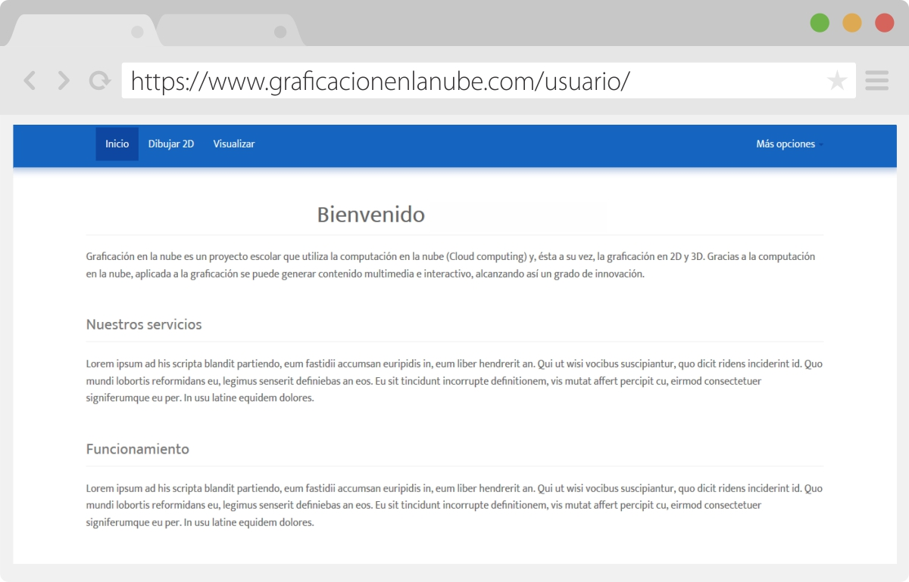
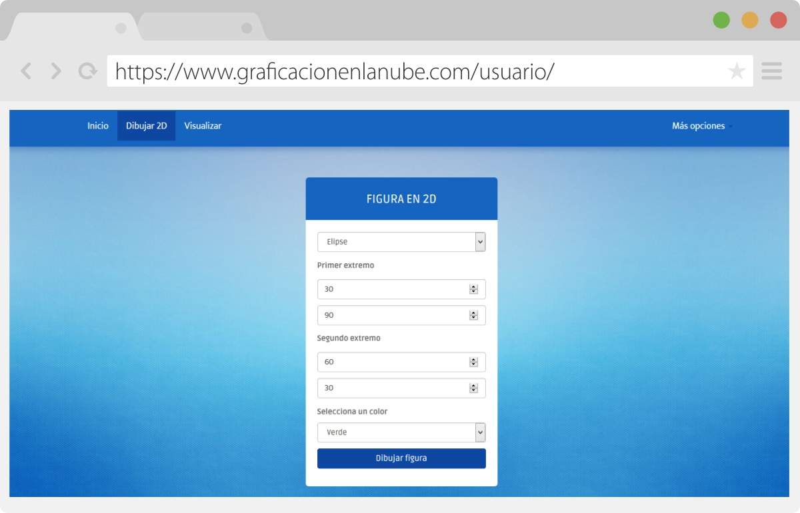
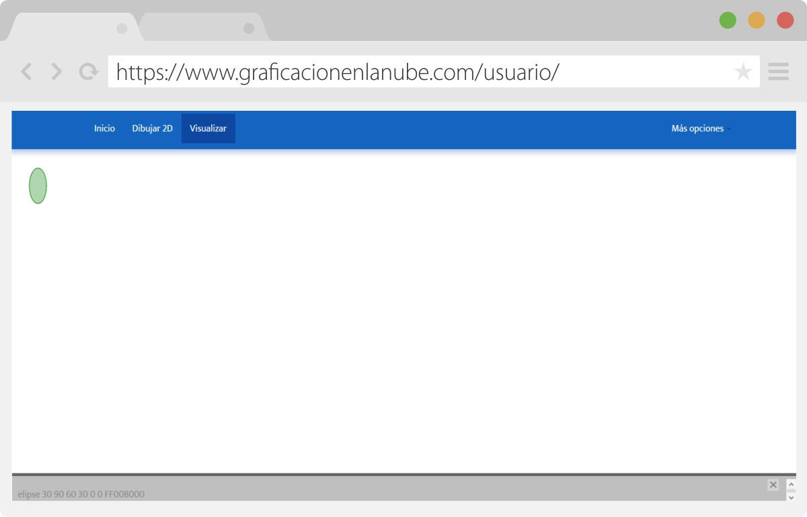

# Graphing-Cloud
Proyecto Graficación en la nube, realizado en la materia de Graficación. Permite dibujar figuras geometricas 2D y 3D almacenando los datos en la nube los cuales son interpretados en el navegador por Processing.JS, aplicando transfomaciones como: Rotación y Traslación.

